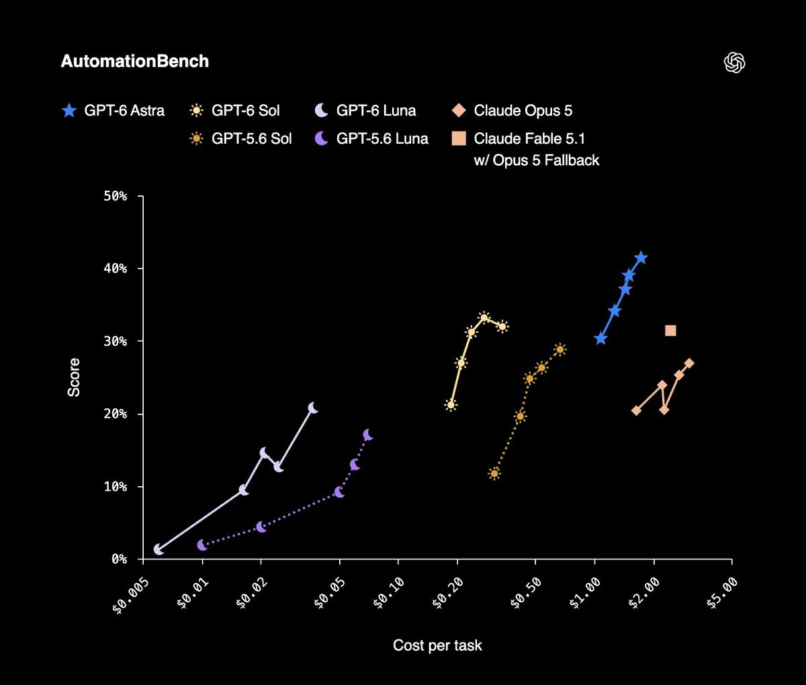
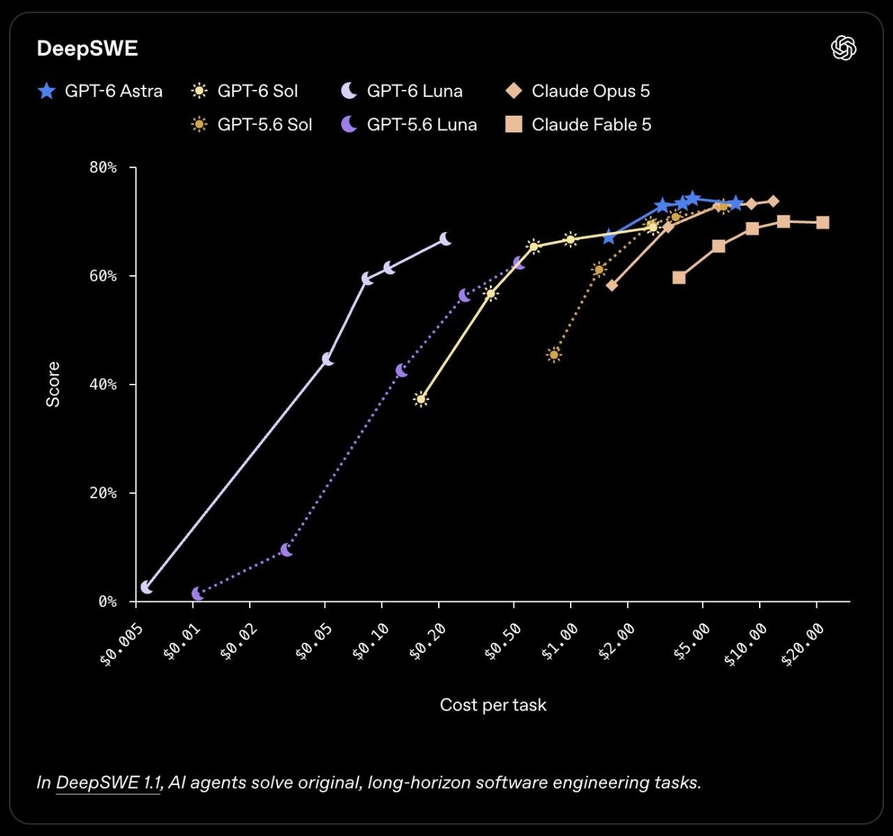

# JEV Codex Pilot

JEV Codex Pilot turns software requests into focused, traceable Codex tickets. It recommends a model and reasoning effort, gives Codex the project instructions, and keeps implementation, checks, usage, and recovery visible in one local workspace.

You keep control at every stage. Review the project files and Git state, edit `AGENTS.md`, inspect live Codex events and the checks Codex chose to run, recover interrupted tasks, and review local changes from one workspace. The execution history makes it clear what JEV decided, what Codex changed, which checks ran, and why a ticket completed, paused, or needs attention. Token totals are reported from completed Codex turns, while account usage is clearly labelled when available.

JEV currently uses the **Vercel AI Gateway API** for ticket analysis and usage data. Its model connection, provider identifiers, dashboard URL, and credit lookup are isolated in `src/core/vercel-ai-gateway.ts`. The evaluation questions remain provider-neutral, so a direct TypeSafe API adapter can be added without duplicating JEV's decision logic.

Model IDs and the default model:reasoning route for each complexity level are configured in `config/model.toml`. Codex can request another implementation turn with stronger reasoning, while keeping the same model for the ticket. Edit `[models]` or `[complexity.N]` and restart JEV to change the routes. Codex chooses and runs any relevant checks during implementation.

JEV assigns each ticket a complexity score from 1 to 5 when it enters the Kanban board. Level 1 covers straightforward work; level 2 covers relatively simple UI changes. Medium UI work, including 3D, starts at level 3; complex 3D or critical, long-horizon work can be level 4 or 5. Expected-outcome clarity is advisory.

---

## Model benchmarks and routing

These charts compare benchmark score with estimated cost per task: AutomationBench covers agent automation tasks, while DeepSWE 1.1 focuses on original, long-horizon software engineering. Each point shows a model at a reasoning effort; moving right costs more, and moving up scores better.





The current defaults are **Luna Medium/High/Max** for complexity levels 1–3 and **Sol High/Extra High** for levels 4–5. Luna keeps lighter tickets on lower-cost routes; Sol's stronger benchmark performance is reserved for more demanding work. **Astra** reaches the highest scores in these comparisons, but at a substantially higher cost, so it remains available in `config/model.toml` without being a default route. These scores guide configurable defaults; they do not guarantee a result for every ticket.

## JEV benchmark

In the latest paired run, all four recipe-manager tasks passed in both variants. JEV used **22.9% fewer Codex tokens at the median** and **41.7% less total elapsed time**. This is one short, exploratory sequence; see the [full report](docs/benchmark-results/report.md), [archived results](docs/benchmark-results/), and [benchmark guide](docs/benchmark.md) for measurements and reproduction details.

## Optimisation

JEV scores each ticket from 1 to 5 and starts Codex on the model and reasoning route configured for that level. Codex can request another implementation turn with stronger reasoning, chooses the checks that fit the task, and reports the commands it ran. JEV records their results and stops repeated failed actions when the project has not changed.

When another ticket is queued, JEV reviews whether it relates to the completed work. It clears unrelated work and compacts a related or uncertain thread after the context reaches 100,000 tokens.

Tickets submitted together are analyzed and executed separately in queue order. Launching a sequence drains every pending ticket for that project, including tickets added while it runs. JEV applies the selected model and reasoning level independently to each ticket.

---

## See JEV Codex Pilot in action


---

## Quickstart

### Install

```bash
npm install
```

### Run

```bash
npm run dev
```

Open `http://localhost:5173`, configure the available provider in Settings, then select or create a local project. API keys and Telegram credentials are stored in `config/config.toml`.

During development, Codex can request additional implementation turns with stronger reasoning. It chooses relevant checks and handles in-scope failures. Route changes and other JEV decisions appear in the execution console; the activity log starts collapsed and can be expanded.

JEV scores expected-outcome clarity and task complexity when the ticket is added to the Kanban board. Clarity is advisory; the 1–5 complexity score selects the default model and reasoning route. Neither score blocks execution.

GitHub Actions runs `.github/workflows/ci.yml` on pushes and pull requests. It installs dependencies from the lockfile, builds and type-checks the app, checks for unused TypeScript declarations, and runs the test suite. It can also be started manually from the Actions tab.

---

## Command line

The headless CLI runs tickets through the same JEV and Codex engine. From the **jev-codex-pilot repository directory**, install dependencies and the command once:

```bash
npm install
npm run setup:cli
```

From the **directory of the target project**, run:

```bash
jc-pilot run "Fix bug X"
jc-pilot status
```

Each `run` invocation creates and executes one ticket. To run several tickets in order, join one command per ticket with `&&`. The shell waits for each ticket to finish before starting the next and stops if a command fails:

```bash
jc-pilot run "Fix bug X" && \
jc-pilot run "Add a regression test for bug X"
```

The target is selected from the current directory. The launcher is installed for your user account (`~/.local/bin` on Linux/macOS or `%LOCALAPPDATA%\jc-pilot\bin` on Windows), so setup is only needed once and should be repeated if you move the JEV repository. The target project needs Node.js only on the machine running JEV, plus an `AGENTS.md`; if it is missing, create one before a noninteractive run. Codex CLI must be installed and authenticated, and JEV needs its configured Vercel AI Gateway key.

To run without installing the launcher, replace the placeholder with your JEV checkout path:

```bash
cd /path/to/your/project
node "/path/to/jev-codex-pilot/bin/jc-pilot.mjs" run "Fix bug X"
node "/path/to/jev-codex-pilot/bin/jc-pilot.mjs" status
```

`run` creates and executes a ticket; `status [ticket-id]` shows the latest ticket or a selected one. The CLI shares `.jev/` history and `config/model.toml` with the app, and uses a running local API when available. See the CLI help (`jc-pilot --help`) for options.

## Telegram

The optional Telegram bot provides a private progress view, guided ticket creation, and explicit Codex launches. It is disabled by default and pairs one private chat. At the end of a run, its completion notice reports the remaining 5-hour Codex session limit and context window for each ticket, when available. The ticket's Codex Summary also shows the weekly limit; older tickets without a snapshot show unavailable values.

## Feedback and bug reports

Improvement ideas and bug reports are welcome via [X](https://x.com/Charlyhno). See [CONTRIBUTING.md](CONTRIBUTING.md) for reporting guidance and contribution scope.
