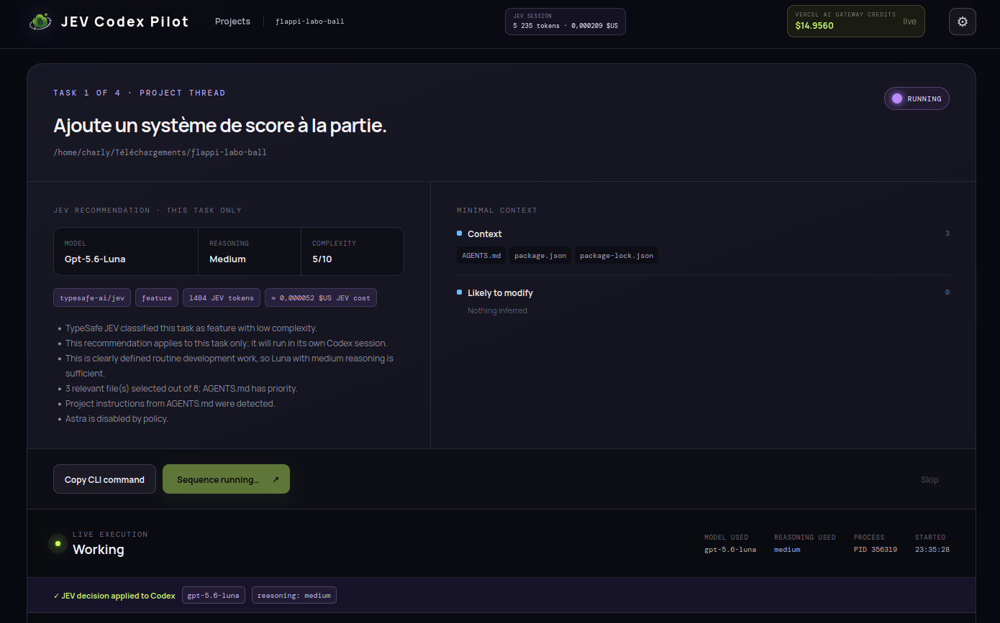
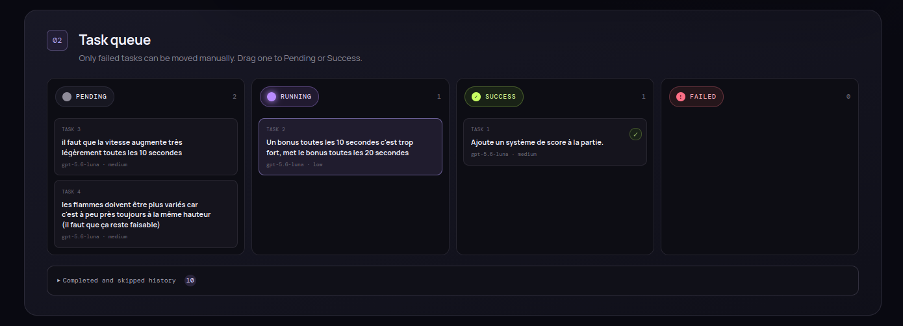

# JEV Codex Pilot

---

JEV Codex Pilot is a local workspace for coordinating software projects with Codex.<br>
It keeps several projects available from one focused interface.<br>
Each task is evaluated independently before execution begins.<br>
The workspace records the recommended model and reasoning level for every task.<br>
Codex runs tasks in separate sessions while preserving project continuity.<br>
Live events make progress, verification, and token usage easy to follow.<br>
Project context is kept in `AGENTS.md` and can be reviewed from the workspace.<br>
Completed work remains available through the project history.<br>
JEV usage and estimated costs are visible during the current session.<br>
The application is designed for local, deliberate, and reversible project work.

---

## See JEV Codex Pilot in action





---

## Getting your Vercel AI Gateway API key

To use JEV, you need a Vercel account and an AI Gateway API key.

1. Create a Vercel account or sign in at [Vercel](https://vercel.com).
2. Open the [JEV model page on Vercel AI Gateway](https://vercel.com/ai-gateway/models/jev).
3. Follow the instructions to enable AI Gateway and create an API key.
4. Copy your API key and add it to the application configuration.
5. Start the classification process.

The API key is used to authenticate requests to JEV through Vercel AI Gateway.

---

## Quickstart

### Install

```bash
npm install
```

### Run

```bash
npm run dev
```

Open `http://localhost:5173`, configure the Vercel AI Gateway key in Settings, and select or create a local project.
