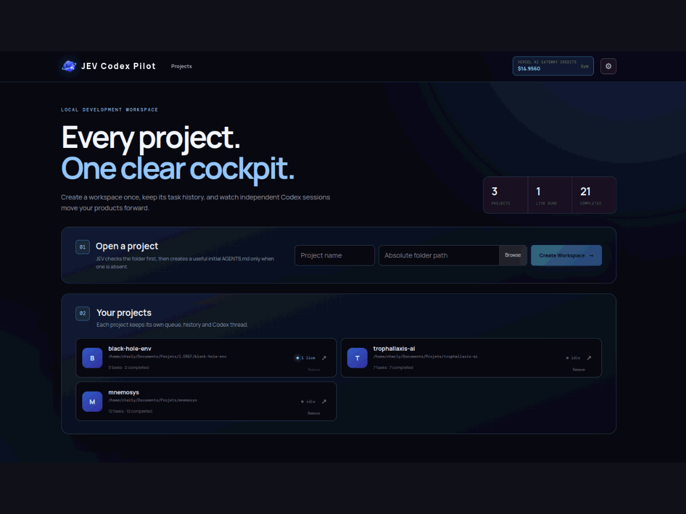

# JEV Codex Pilot

JEV Codex Pilot is a local control center for turning software ideas into focused, traceable Codex work. It gives each ticket a clear path from project understanding to implementation, verification, recovery, and review. JEV analyses the request before execution, identifies the relevant project context, recommends the right model and reasoning effort, and keeps the full run visible in one place.

The main goal is a more deliberate development workflow. JEV turns broad requests into actionable tickets, gives Codex a bounded starting set of relevant files, adapts model effort during the run, validates only the changed surface, and stops when the result is already satisfactory. It records routing decisions, verification notes, token usage, session limits, interruptions, and recoverable errors so long running work remains understandable and manageable.

It is designed to reduce unnecessary Codex work as a consequence of that workflow. JEV records estimates and actual Codex usage per ticket so the effect can be reviewed in the application instead of assumed.

You keep control at every stage. Review the project files and Git state, edit `AGENTS.md`, inspect live Codex events, follow verification results, recover interrupted tasks, and review local changes from one workspace. The execution history makes it clear what JEV decided, what Codex changed, which checks ran, and why a ticket completed, paused, or needs attention. Token totals are reported from completed Codex turns, while account usage is clearly labelled when available.

JEV currently uses the **Vercel AI Gateway API** for ticket analysis and usage data. The integration is kept in the project code so developers can adapt it to another provider or a self-hosted API when needed.

## How JEV reduces unnecessary Codex work

JEV makes small, bounded decisions before asking Codex to reason through a full turn. The table shows where token savings can come from. The ranges describe the affected part of a workflow, so they should not be added together.

### Expected token savings

| Workload | Estimated Codex token reduction |
| --- | ---: |
| Clear, focused ticket | **10–25%** |
| Typical work in an established project | **25–45%** |
| Long session with large context and targeted verification | **40–55%** |
| Unusually favourable case | **Up to 60%** |

These are practical estimates, not guaranteed results. Repository size, ticket quality, cache reuse, and genuine repair work have a material effect. JEV itself uses small typed evaluations, so the estimated **net reduction across all LLM usage** is more conservatively **15–35%** until project metrics provide a measured baseline.

| Optimisation | What JEV does | Typical Codex impact |
| --- | --- | --- |
| Relevant-file context | Identifies the files Codex should inspect first and sends the affected files forward for verification. | Avoids loading unrelated code; often the largest saving on established repositories. |
| Typed decision offload | Handles boolean checks, multiple choices, scores, routing, and validation judgments through compact Noul, Choice, and Score requests. Uncertain answers escalate to Codex. | Removes full Codex turns for decisions that do not need prose or code. |
| Dynamic model and effort routing | Keeps a route stable when cache reuse matters, lowers effort for verification and routine commands, and escalates repeated repair failures to Sol High. | Reduces reasoning output on routine turns while reserving stronger reasoning for difficult repairs. |
| Targeted verification | Reviews the actual changed files and approves tests that cover that surface. Environment-blocked checks finish with a note instead of entering a repair loop. | Avoids broad test runs and repeated investigations caused by missing local dependencies. |
| Early validation stop | Stops repair and analysis turns as soon as the required checks are satisfied. | Saves the extra turns that simple tickets often spend rechecking a completed result. |
| Context diet and compaction | Reviews tool output after use, protects errors, paths, and test evidence, and marks redundant history before compaction. JEV also compacts when measured context reaches 90,000 tokens. | Keeps long sessions from carrying stale output into later turns; the native pre-compaction review is advisory. |
| Compatible ticket grouping | May execute compatible queued tickets in one shared run when their route settings are close enough. | Reduces repeated project orientation and allows more cache reuse. |

The shell gate is part of the same control layer: before a shell command, JEV checks its relevance and risk. It is fail-open when JEV is unavailable, and it logs the decision without exposing the raw command. This protects workflow quality without turning a temporary analysis issue into a blocked Codex session.

Each completed ticket shows the planning estimate, actual Codex tokens, cached input, turns, repair count, model routes, validation outcome, and available Codex session limits. These measurements make it possible to compare workflow changes against real usage over time.

## See JEV Codex Pilot in action



## Quickstart

### Install

```bash
npm install
```

### Run

```bash
npm run dev
```

Open `http://localhost:5173`, configure the available provider in Settings, then select or create a local project.

During development, JEV can route successive Codex turns to different model tiers and reasoning efforts. A turn keeps its selected settings until it finishes; the next turn can be routed from the work still required. Verification normally uses a low-effort route, while repeated failed checks can trigger a stronger repair route. Every route, hook decision, selected context file, command gate, and context-diet action is visible in the backend logs and execution console.

The task breakdown score is advisory. It indicates whether a ticket looks like one focused unit of work and never blocks execution.

## Telegram

The optional Telegram bot provides a private progress view, guided ticket creation, and explicit Codex launches. It is disabled by default, pairs one private chat, and sends a completion summary when a development run ends.

## Project principles

- JEV analyses projects without changing their files or running their tests.
- Codex runs only after an explicit user action.
- Project history, context, and execution data remain separated per project.
- API keys stay local and are never shown in logs or UI output.
