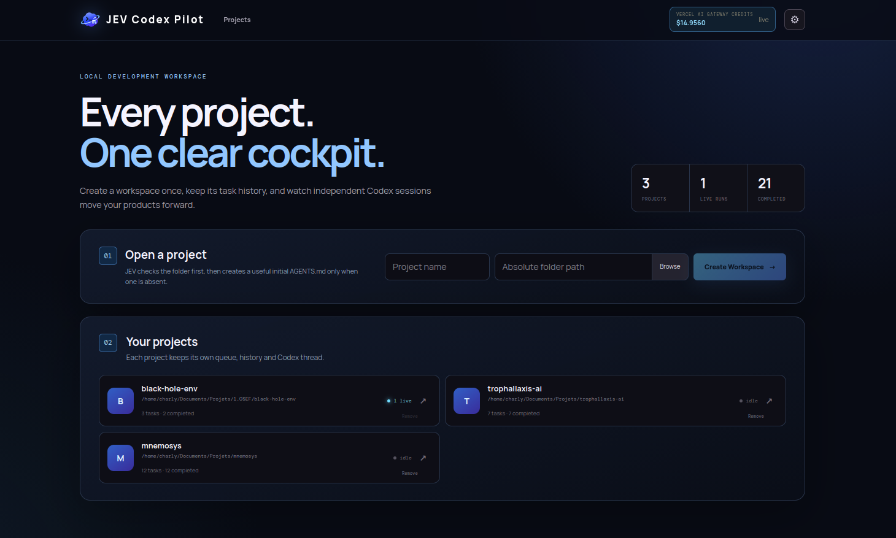
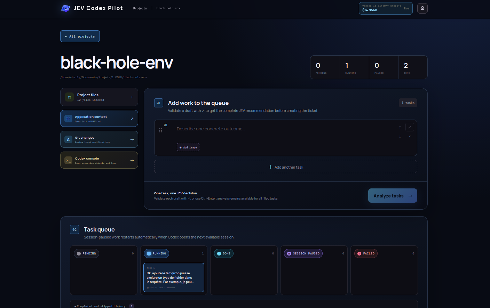
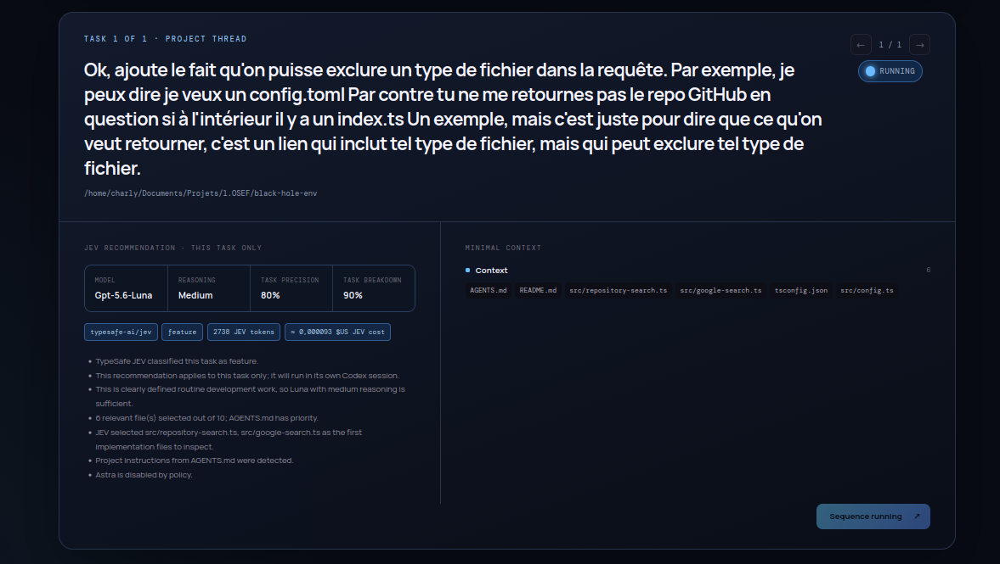
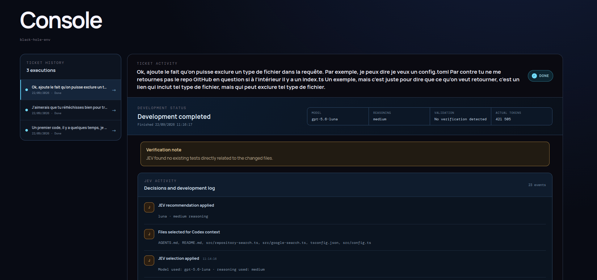

# JEV Codex Pilot

JEV Codex Pilot is a local control center for turning software ideas into focused, traceable Codex work. It gives each ticket a clear path from project understanding to implementation, verification, recovery, and review. JEV analyses the request before execution, identifies the relevant project context, recommends the right model and reasoning effort, and keeps the full run visible in one place.

The main goal is a more deliberate development workflow. JEV helps turn broad requests into actionable tickets, keeps Codex focused on the files that matter, adapts model effort during the run, validates only the relevant changes, and stops once the result is satisfactory. It also records routing decisions, verification notes, token usage, session limits, interruptions, and recoverable errors so that a long running task remains understandable and manageable.

This workflow also reduces unnecessary Codex work. Selective context, compatible ticket grouping, low effort verification, targeted repairs, early validation stops, and automatic compaction can reduce token usage by roughly **20–40% in typical mixed workloads**. These are practical estimates rather than guaranteed benchmarks: repository size, ticket quality, and the number of required repairs still have a major impact.

You keep control at every stage. Review the project files and Git state, edit `AGENTS.md`, inspect live Codex events, follow verification results, recover interrupted tasks, and review local changes from one workspace. The execution history makes it clear what JEV decided, what Codex changed, which checks ran, and why a ticket completed, paused, or needs attention. Token totals are reported from completed Codex turns, while account usage is clearly labelled when available.

JEV currently uses the **Vercel AI Gateway API** for ticket analysis and usage data. The integration is kept in the project code so developers can adapt it to another provider or a self-hosted API when needed.

## See JEV Codex Pilot in action









## Quickstart

### Install

```bash
npm install
```

### Run

```bash
npm run dev
```

Open `http://localhost:5173`, configure the available provider in Settings, then select or create a local project.

During development, JEV can route successive Codex turns to different model tiers and reasoning efforts. A turn keeps its selected settings until it finishes; the next turn can be routed based on the work still required. Verification normally uses a low effort route, while failed checks can trigger a stronger repair route. Every route is visible in the backend logs and in the execution console, making the workflow auditable rather than opaque.

The task breakdown score is advisory. It indicates whether a ticket looks like one focused unit of work and never blocks execution.

## Telegram

The optional Telegram bot provides a private progress view, guided ticket creation, and explicit Codex launches. It is disabled by default, pairs one private chat, and sends a completion summary when a development run ends.

## Project principles

- JEV analyses projects without changing their files or running their tests.
- Codex runs only after an explicit user action.
- Project history, context, and execution data remain separated per project.
- API keys stay local and are never shown in logs or UI output.
