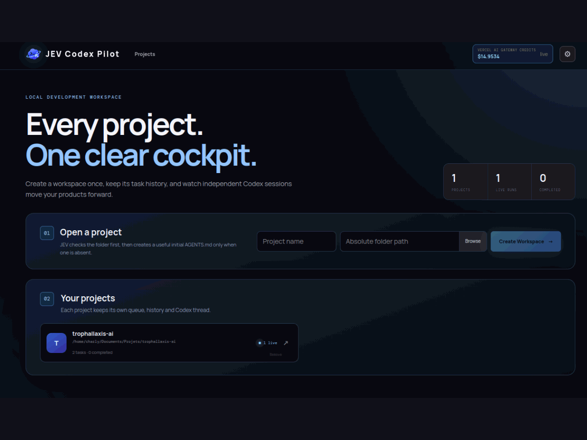

# JEV Codex Pilot

JEV Codex Pilot turns software requests into focused, traceable Codex tickets. It recommends a model and reasoning effort, gives Codex the project instructions, and keeps implementation, checks, usage, and recovery visible in one local workspace.

You keep control at every stage. Review the project files and Git state, edit `AGENTS.md`, inspect live Codex events and the checks Codex chose to run, recover interrupted tasks, and review local changes from one workspace. The Git workspace shows the current branch, all unpushed commits, and per-commit diffs. Pushed commits disappear from the review list. For a branch without upstream tracking, JEV uses its matching remote branch when available, otherwise excludes commits already present on any known remote branch. You can create or select a local branch there. An optional per-project checkbox lets JEV commit each successful ticket locally with a Codex-suggested Conventional Commit subject (`feat:`, `fix:`, etc.) before starting the next ticket. Missing or invalid prefixes fall back to `chore:`. A ticket with no file changes receives an empty commit, so there is still one commit per successful ticket. Use **Push current branch** in the Git workspace when you want to push. JEV never creates a branch automatically. Uncommitted local changes do not block tickets and are included in the next successful ticket’s automatic commit alongside its changes. Automatic commits require the selected project folder to be the repository root; they do not require a remote. The execution history makes it clear what JEV decided, what Codex changed, which checks ran, and why a ticket completed, paused, or needs attention. Token totals are reported from completed Codex turns, while account usage is clearly labelled when available.

JEV currently uses the **Vercel AI Gateway API** for ticket analysis and usage data. Its model connection, provider identifiers, dashboard URL, and credit lookup are isolated in `src/core/vercel-ai-gateway.ts`. The evaluation questions remain provider-neutral, so a direct TypeSafe API adapter can be added without duplicating JEV's decision logic.

Model IDs and the default model:reasoning route for each complexity level are configured in `config/model.toml`. Before launch, pending tickets can be manually adjusted across all configured models and reasoning efforts. Codex can request another implementation turn with stronger reasoning, while keeping the same model for the ticket. Edit `[models]` or `[complexity.N]` and restart JEV to change the routes. Codex chooses and runs any relevant checks during implementation.

JEV assigns each ticket a complexity score from 1 to 5 when it enters the Kanban board. The project workspace keeps the task composer compact and displays the six queue states in a responsive three-column board so ticket details remain readable. The Git workspace confirms a successful manual push with the branch and remote. Level 1 covers straightforward work; level 2 covers relatively simple UI changes. Medium UI work, including 3D, starts at level 3; complex 3D or critical, long-horizon work can be level 4 or 5. Expected-outcome clarity is advisory.

---

## Model benchmarks and routing

DeepSWE-inspired benchmark scores and estimated cost per task by reasoning effort:

| Effort | **GPT-6 Luna** Score | Cost | **GPT-6 Sol** Score | Cost | **GPT-6.1 Sol** Score | Cost | **GPT-6 Astra** Score | Cost | **GPT-5.6 Sol** Score | Cost |
| --- | ---: | ---: | ---: | ---: | ---: | ---: | ---: | ---: | ---: | ---: |
| **Low** | 2,4 % | ~$0,006 | 37,2 % | ~$0,16 | **~64 %** | **~$0,25** | 67,0 % | ~$1,60 | 45,4 % | ~$1,07 |
| **Medium** | 44,5 % | ~$0,052 | 56,6 % | ~$0,38 | **~73 %** | **~$0,50** | 72,8 % | ~$3,08 | 61,1 % | ~$1,86 |
| **High** | 59,3 % | ~$0,084 | 65,3 % | ~$0,64 | **~75 %** | **~$0,80** | 73,2 % | ~$3,92 | 69,4 % | ~$3,47 |
| **XHigh** | 61,3 % | ~$0,11 | 66,6 % | ~$1,00 | **~75,2 %** | **~$1,00** | 74,1 % | ~$4,43 | 70,7 % | ~$4,70 |
| **Max** | 66,6 % | ~$0,22 | 68,8 % | ~$2,74 | **~74 %** | **~$1,50** | 73,2 % | ~$7,50 | 72,7 % | ~$8,39 |

The current defaults are **GPT-6 Luna Medium** for complexity level 1, **GPT-6 Luna High** for level 2, and **GPT-6.1 Sol Low/Medium/High** for levels 3–5. These scores guide configurable defaults; they do not guarantee a result for every ticket.

---

## JEV benchmark

In the latest paired run on September 27, 2026, all seven laboratory-portfolio tasks passed in both variants. JEV used **69.8% fewer total Codex tokens** and **48.4% less elapsed time** than direct Codex. This was one exploratory repetition; see the [full report](docs/benchmark-results/report2.md), [archived results](docs/benchmark-results/), and [benchmark guide](docs/benchmark.md) for measurements and reproduction details.

---

## Optimisation

JEV scores each ticket from 1 to 5 and starts Codex on the model and reasoning route configured for that level. Codex can request another implementation turn with stronger reasoning, chooses the checks that fit the task, and reports the commands it ran. JEV records their results and stops repeated failed actions when the project has not changed.

When another ticket is queued, JEV reviews whether it relates to the completed work. It clears unrelated work and compacts a related or uncertain thread after the context reaches 100,000 tokens.

Before native Codex compaction, JEV replays the active transcript and pairs completed tool calls with their results. It independently decides whether to keep each pair verbatim, keep the call with a bounded result (`drop_result`), or remove the pair (`drop_call`). User and assistant text remains verbatim, the newest transcript items are pinned, and malformed or unavailable JEV decisions fall back to native compaction. The retained context is written to a private temporary checkpoint with secrets redacted. After Codex compacts the thread, a `SessionStart` hook compares the compacted history with that checkpoint and immediately restores missing high-priority content within a fixed context budget; overflow remains available in the private checkpoint.

Tickets submitted together are analyzed and executed separately in queue order. Launching a sequence drains every pending ticket for that project, including tickets added while it runs. JEV applies the selected model and reasoning level independently to each ticket.

You can launch ticket sequences in several projects at the same time. Each project runs Codex concurrently in its own `CODEX_HOME`, with separate sessions and SQLite state. JEV links the user's existing Codex authentication and settings into each private home and imports that project's earlier sessions when it first creates the home. Codex account limits remain shared across projects.

---

## See JEV Codex Pilot in action



---

## Quickstart

### Install

```bash
npm install
```

### Run

```bash
npm run dev
```

Open `http://localhost:5173`, configure the available provider in Settings, then select or create a local project. API keys are stored in `config/config.toml`.

During development, Codex can request additional implementation turns with stronger reasoning. It chooses relevant checks and handles in-scope failures. Route changes and other JEV decisions appear in the execution console; the activity log starts collapsed and can be expanded.

JEV scores expected-outcome clarity and task complexity when the ticket is added to the Kanban board. Clarity is advisory; the 1–5 complexity score selects the default model and reasoning route. Neither score blocks execution.

GitHub Actions runs `.github/workflows/ci.yml` on pushes and pull requests. It installs dependencies from the lockfile, builds and type-checks the app, checks for unused TypeScript declarations, and runs the test suite. It can also be started manually from the Actions tab.

---

## Terminal interface

Install the terminal command once from the JEV repository:

```bash
cd /path/to/jev-codex-pilot
npm install
npm run setup:cli
```

Open a new terminal, go to the project you want to work on, and launch the interface:

```bash
cd /path/to/your/project
jc-pilot
```

---

## Feedback and bug reports

Improvement ideas and bug reports are welcome via [X](https://x.com/Charlyhno). See [CONTRIBUTING.md](CONTRIBUTING.md) for reporting guidance and contribution scope.
