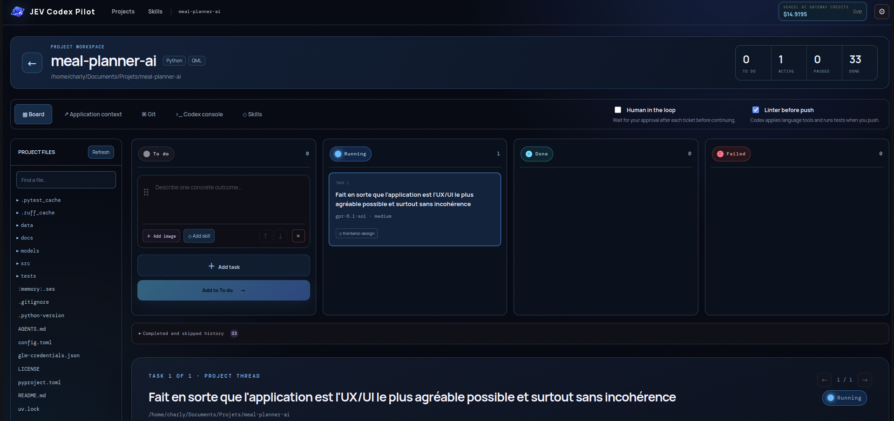

# JEV Codex Pilot

JEV Codex Pilot provides a complete local workflow for software requests, from ticket creation and planning to Codex execution, human review, and Git delivery. It recommends a model and reasoning effort, gives Codex the project instructions, and keeps implementation, checks, usage, and recovery visible in one local workspace.

You keep control at every stage. Review the project files and Git state, edit `AGENTS.md`, inspect live Codex events and the checks Codex chose to run, recover interrupted tasks, and review local changes from one workspace. The Git workspace shows the current branch, all unpushed commits, and per-commit diffs. Pushed commits disappear from the review list. For a branch without upstream tracking, JEV uses its matching remote branch when available, otherwise excludes commits already present on any known remote branch. You can create or select a local branch there. An optional per-project checkbox lets JEV commit each successful ticket locally with a Codex-suggested Conventional Commit subject (`feat:`, `fix:`, etc.) before starting the next ticket. Missing or invalid prefixes fall back to `chore:`. A ticket with no file changes receives an empty commit, so there is still one commit per successful ticket. Use **Push current branch** in the Git workspace when you want to push. JEV never creates a branch automatically. Uncommitted local changes do not block tickets and are included in the next successful ticket’s automatic commit alongside its changes. Automatic commits require the selected project folder to be the repository root; they do not require a remote. The execution history makes it clear what JEV decided, what Codex changed, which checks ran, and why a ticket completed, paused, or needs attention. Token totals are reported from completed Codex turns, while account usage is clearly labelled when available. The ticket summary shows cumulative **JEV credits** in USD, including ticket evaluation and re-evaluation, continuity reviews, and native hooks during implementation and compaction. Usage stays attached to the ticket across retries, escalation, and quota resumes. The amount is an estimate from reported input tokens at $0.04 per million; it is not a billing receipt. Missing provider usage or older tickets without complete telemetry show an unavailable or incomplete amount. Continuity reviews performed after completion are charged to the completed ticket; reviews needed at startup are charged to the starting ticket.

JEV currently uses the **Vercel AI Gateway API** for ticket analysis and usage data. Its model connection, provider identifiers, dashboard URL, and credit lookup are isolated in `src/core/vercel-ai-gateway.ts`. The evaluation questions remain provider-neutral, so a direct TypeSafe API adapter can be added without duplicating JEV's decision logic.

Model IDs and the default model:reasoning route for each complexity level are configured in `config/model.toml`. Before launch, pending tickets can be manually adjusted across all configured models and reasoning efforts. Codex can request another implementation turn with stronger reasoning, while keeping the same model for the ticket. Edit `[models]` or `[complexity.N]` and restart JEV to change the routes. Codex chooses and runs any relevant checks during implementation.

JEV assigns each ticket a complexity score from 1 to 5 when it enters the Kanban board. Level 1 is reserved for reading or explaining documentation, project information, or code, plus limited edits to `README.md` or `AGENTS.md`. Level 2 covers simple implementation work, running tests, installation commands, and tiny cosmetic-only visual tweaks that do not change layout, accessibility, or interaction. Any UI/UX change starts at level 3; complex UI/UX or 3D work can be level 4, and critical or long-horizon work can be level 5. Expected-outcome clarity is advisory. The project workspace groups the six active ticket states into four responsive columns, and the Git workspace confirms successful manual pushes with the branch and remote.

---

## Ticket execution and continuity

JEV scores each ticket from 1 to 5 and starts Codex on the model and reasoning route configured for that level. The current defaults are **GPT-6 Luna Medium** for level 1, **GPT-6 Luna High** for level 2, and **GPT-6.1 Sol Low/Medium/High** for levels 3–5. Codex can request another implementation turn with stronger reasoning, chooses the checks that fit the task, and reports the commands it ran. JEV records their results and stops repeated failed actions when the project has not changed.

When another ticket is queued, JEV reviews whether it relates to the completed work. It clears unrelated work and compacts a related or uncertain thread after the context reaches 100,000 tokens.

Before native Codex compaction, JEV replays the active transcript and pairs completed tool calls with their results. It independently decides whether to keep each pair verbatim, keep the call with a bounded result (`drop_result`), or remove the pair (`drop_call`). User and assistant text remains verbatim, the newest transcript items are pinned, and malformed or unavailable JEV decisions fall back to native compaction. The retained context is written to a private temporary checkpoint with secrets redacted. After Codex compacts the thread, a `SessionStart` hook compares the compacted history with that checkpoint and immediately restores missing high-priority content within a fixed context budget; overflow remains available in the private checkpoint.

In the web board, **Add & run** saves tickets immediately and explicitly requests execution. With an empty composer and existing pending tickets, the same button becomes **Run N tasks** and launches the saved queue, including linter setup tickets, without requiring another description or a particular selected card. It starts an idle project queue or appends work to its active sequence; existing human-review and session-limit pauses still require their normal continuation. API clients can request the same behavior with `POST /api/jobs` and `run: true`; omitting it only creates tickets. Tickets submitted together are analyzed and executed separately in queue order. Launching a sequence drains every pending ticket for that project, including tickets added while it runs. JEV applies the selected model and reasoning level independently to each ticket. Concurrent preparation requests share one evaluation per ticket and description. JEV decisions time out after 60 seconds so unavailable analysis or continuity services cannot hold the queue indefinitely; successful re-evaluation clears its earlier JEV error. The board uses actual server activity to release execution controls when a sequence ends.

**Re-evaluate ticket** requests a fresh analysis for an idle pending ticket. Manual model and reasoning adjustments survive reloads and manual retries. The selected ticket cannot be edited, removed, skipped, or adjusted while it is preparing or executing; other pending tickets remain editable. Editing a previously reviewed next ticket also refreshes the continuity decision before its execution. Compaction and thread archival require an explicit Codex confirmation, and finalization failures release the project execution slot with a recorded ticket error.

You can launch ticket sequences in several projects at the same time. Each project runs Codex concurrently in its own `CODEX_HOME`, with separate sessions and SQLite state. JEV links the user's existing Codex authentication and settings into each private home and imports that project's earlier sessions when it first creates the home. Codex account limits remain shared across projects.

---

## See JEV Codex Pilot in action



---

## Quickstart

### Install

```bash
npm install
```

### Run

```bash
npm run dev
```

Open `http://localhost:5173`, configure the available provider in Settings, then select or create a local project. JEV automatically creates `config/config.toml` with an empty API key when local settings are first loaded by the API or CLI. Existing settings are preserved. The `.gitignore` excludes this file from new commits; it stores your local provider configuration and API key; each user configures their own key in Settings. For a checkout where this file is already tracked, run `git rm --cached -- config/config.toml` once and commit that removal; the local settings file stays on disk.

The web workspace polls lightweight ticket summaries, and the console loads logs only for the displayed ticket. Polls do not overlap, unchanged responses do not redraw the workspace, and hidden browser tabs poll less frequently while continuing to receive ticket alerts. Live Codex telemetry is saved in grouped snapshots at most every 250 ms between immediate ticket changes; status changes are saved immediately and controlled API shutdown flushes remaining telemetry. An abrupt termination can lose the last buffered telemetry updates.

During development, Codex can request additional implementation turns with stronger reasoning. It chooses relevant checks and handles in-scope failures. Route changes and other JEV decisions appear in the execution console; the activity log starts collapsed and can be expanded.

JEV scores expected-outcome clarity and task complexity when the ticket is added to the Kanban board. Clarity is advisory; the 1–5 complexity score selects the default model and reasoning route. Neither score blocks execution.

GitHub Actions runs `.github/workflows/ci.yml` on pushes and pull requests. It installs dependencies from the lockfile, builds and type-checks the app, checks for unused TypeScript declarations, runs ESLint, and runs the test suite. Run the same checks locally with `npm run build && npm run lint && npm test`. The workflow can also be started manually from the Actions tab.

---

## Browser project workspace

The task workspace uses the full available width, up to 1,920 pixels, with a searchable read-only file tree on the left and four columns side by side on desktop: **To do**, **Running**, **Done**, and **Failed**. Smaller screens wrap the columns. Create tickets directly in **To do**, including optional image attachments, ticket-specific skills, and multiple drafts. Pending ticket reordering, editing, model adjustments, and explicit execution actions remain available. Draft typing updates only the composer instead of re-rendering the board and file explorer; textarea height measurements are grouped per animation frame, and file-tree filtering and construction are cached until the files or search change.

Escalating tickets stay in **Running** and receive a violet outline, retained after escalation. **Session paused** tickets appear in **Failed** with an amber outline and keep their session-resume behavior. Paused tickets are labeled separately and cannot be manually validated as failed tickets. Internal ticket statuses and execution rules are unchanged.

Draft cards place image and skill attachment on the left of a dedicated footer, with horizontal reorder arrows and removal on the right. Source dialogs open above the entire workspace.

Saving tickets preserves unsent drafts and changes typed during the request. Submission waits for selected images to finish loading, and edits enforce the same four-image limit including existing references. A failed board refresh after successful creation does not turn saved tickets into a failed submission.

The toolbar places **Application context** (the complete AGENTS.md) immediately after **Board**, followed by **Git**, **Codex console**, **Skills**, and **Human in the loop**. Human review can be changed during execution and pauses after each ticket when enabled. The former empty sliding panel and browser terminal are no longer shown.

Select a file in the left explorer to open a read-only source viewer with syntax colors and line numbers. Folders start collapsed; **Refresh** reloads the index. Generated folders and common credential files are hidden, credential assignments are masked, and the viewer rejects external paths and text files larger than 1 MB. Browsing files does not launch Codex or project commands.

The dedicated **Git** page retains branch selection, automatic local commits, manual push, and unpushed-commit review. Git shows the current branch, changed-file count, and Refresh action on the right of its page header. Git and Codex console pages share the wider workspace layout.

Git previews hide private paths and mask common credential assignments in working-tree and commit diffs. Untracked previews refuse private or external link targets, and initial staged files, nested untracked files, and both paths of a rename remain reviewable. The local API rejects browser requests from external origins and untrusted hosts without wildcard CORS access; revealing saved credentials requires a local browser origin. Local CLI requests remain supported.

Project cards and the project workspace header show detected source languages, ordered by source-file count. Detection uses filename extensions without reading file contents or running project commands; dependencies, generated directories, private paths, symbolic links, minified assets, and TypeScript declarations are excluded. Scans are bounded and cached for 30 seconds; reopen or refresh the page after that interval to see source changes. Projects without recognized source files show **No languages detected**. These labels describe source files, not dependencies or a percentage of code. A green **Linter** badge appears alongside them when every detected supported language has lint setup according to JEV’s preparation checks. Empty projects and projects with missing setup do not show this badge. Configuration scans are cached for 30 seconds and refreshed after successful tickets; Rust and Go toolchain setup uses successful preparation records. The badge indicates configuration, not a passing lint result.

### Shared skills

Open **Skills**, immediately to the right of **Codex console**, to browse a library shared by all projects in this JEV installation. Search or filter the library, inspect instructions, and import either a `SKILL.md` file or a single skill folder with `SKILL.md` at its root. Folder imports preserve references, scripts, and binary assets. Imports accept up to 100 files and 2 MB per skill; `SKILL.md` is limited to 64 KB and must include YAML `name` and `description` frontmatter. Credential files, invalid paths, and duplicate resources are rejected. Common credential assignments are masked in instruction previews.

Thirteen built-in skills ship in `skills/`: eleven Internet-sourced skills, a README writing skill based on the supplied guidelines, and an advanced Rust performance skill. The library shows five cards per row on wide desktop screens, adapts to smaller screens, and opens details in a keyboard-accessible popup with source, license, instructions, and included resources. Filter by Design, Performance, Architecture, Documentation, or Imported.

| Focus | Published skills | Source |
| --- | --- | --- |
| Web interface design | `frontend-design` | [Anthropic](https://github.com/anthropics/skills/tree/main/skills/frontend-design) |
| Qt/QML and Python desktop design | `qt-qml`, `py-side6-gui-design` | [Qt](https://github.com/TheQtCompanyRnD/agent-skills), [Joey-1123](https://github.com/Joey-1123/opencode-v2-skills) |
| GPUI/Rust interface design | `gpui-kit-design-guides` | [Longbridge](https://github.com/longbridge/gpui-kit/tree/main/skills/gpui-kit-design-guides) |
| React performance and architecture | `vercel-react-best-practices`, `vercel-composition-patterns` | [Vercel](https://github.com/vercel-labs/agent-skills) |
| Python performance and architecture | `python-performance-optimization`, `python-project-structure`, `python-design-patterns` | [Seth Hobson](https://github.com/wshobson/agents/tree/main/plugins/python-development/skills) |
| Low-level Rust performance | `rust-low-level-performance` | Local guidance with official Rust references |
| README writing | `readme-writing` | User-provided guidelines |
| Rust performance, APIs, and project structure | `rust-engineer`, `rust-skills` | [Jeff Allan](https://github.com/Jeffallan/claude-skills/tree/main/skills/rust-engineer), [Leonardo Moura](https://github.com/leonardomso/rust-skills) |

The previous six JEV-authored built-ins have been replaced. Retrieved upstream instructions are preserved rather than rewritten. `skills/catalog.json` records local SHA-256 hashes and, for upstream skills, each source, retrieval date, and license; upstream folders include an `UPSTREAM.md` attribution file. Bundled resources include the complete Vercel compiled guides, GPUI design and coding guides, and retrieved Python/Rust references. Some supporting resources remain upstream, notably additional Rust rules and PySide6 assets; Codex can consult the recorded source when needed. This is a curated local snapshot, not automatic synchronization with upstream repositories. Existing tickets retain their frozen skill versions.

The **readme-writing** skill requires a real banner first, one application title followed by a separator, 8–13 concise English description lines, an optional existing visual, and a final Quickstart with verified Install and Run commands. Missing banners or commands are reported rather than invented. The detailed product sections in this project are not part of that compact template.

The **rust-low-level-performance** skill covers profiling, memory layout, SIMD, architecture intrinsics, and inline assembly within Rust. Its orange **Advanced · profile first** note appears on its library card, in its details, in the skill picker, and beneath selected draft or edited-ticket skills. Use it for a measured CPU or memory-access hotspot or an explicit hardware requirement; routine Rust work, I/O waits, and speculative micro-optimization should use the general Rust skills. The instructions require justified unsafe invariants, supported CPU dispatch and fallback where applicable, representative before/after measurements, and correctness checks. The note remains attached to frozen ticket skills after reloads and retries. It is usage guidance and adds no confirmation step or automatic execution.

Use **Add skill** beside **Add image** to attach up to three skills to one draft ticket. Selected skills appear on its board card and can be changed or removed through pending-ticket editing. Every ticket keeps frozen instructions and resource copies in JEV's private `.jev/ticket-skills/` storage; imported library entries persist in `.jev/skills.json`. Removing an imported skill from the library preserves existing ticket copies. Built-in skills remain available after library changes. Skills are passed explicitly to Codex only when the ticket runs, including retries and thread resumes, with an instruction to disregard previous tickets' skills. Importing or selecting a skill does not launch Codex, execute its scripts, install it globally in Codex, or write it into a target project.

## Terminal interface

Install the terminal command once from the JEV repository:

```bash
cd /path/to/jev-codex-pilot
npm install
npm run setup:cli
```

Open a new terminal, go to the project you want to work on, and launch the interface:

```bash
cd /path/to/your/project
jc-pilot
```

The CLI respects the project's Human in the loop setting. When review pauses an API-backed sequence, it reports the pause and returns; approve the ticket in the web workspace before continuing. The setting can also be disabled while a ticket is running and takes effect when that ticket finishes.

---

## Feedback and bug reports

Improvement ideas and bug reports are welcome via [X](https://x.com/Charlyhno). See [CONTRIBUTING.md](CONTRIBUTING.md) for reporting guidance and contribution scope.

The Kanban workspace announces ticket completion, failure, and escalation with distinct green, red, and amber alerts and louder multi-note sounds (ascending success, descending failure, alternating escalation). Alerts include the ticket description and can be dismissed. Audio becomes available after a click or key press in the workspace, subject to browser audio permissions and system volume. Existing tickets do not trigger alerts when opening a project.

After a server interruption during model escalation, JEV returns the ticket to Pending once its previous Codex process has exited. The next explicit Run processes it normally in queue order, moves it to Running, and continues the partial work in its saved thread at the selected model and reasoning level. Earlier attempt errors remain in the history and do not block the new attempt or the following tickets.

Once a queue run starts, JEV continues pending tickets in saved order after continuity review and compaction. Automatic Git commit errors and ticket startup failures are recorded on the affected ticket and logged without stopping later tickets. Explicit human review and Codex session limits still pause execution.

The project sidebar includes an optional **Human in the loop** checkbox, disabled by default. The option can be changed while tickets are running and takes effect when the current ticket finishes. When enabled, each finished ticket (including automatic escalation attempts and Git delivery) pauses the sequence for human review; the pause survives reloads and server restarts. **Continue** approves the result and runs the next pending ticket in queue order, or a ticket returned to Pending for correction. The final ticket can be approved without launching more work. Drag completed or failed ticket cards with the mouse into **Pending** to return them to the queue without starting execution. Eligible destination columns are highlighted while dragging. Within **Pending**, drag a card above or below another card to change execution order, or drop it into the empty column area to put it last. The saved order survives reloads and applies across submitted batches; rearranging tickets does not start Codex. Returned tickets can be edited, re-evaluated, and raised one model or reasoning level using the recommendation controls before continuing. Human review suppresses automatic retries of earlier tickets after later successes. Disabling the option clears the review pause; launching the queue remains an explicit action.


Lint setup is enabled by default. When a project is registered or opened, JEV inspects supported source paths, manifests, and lint configuration without running target commands. Missing setup creates a visible **Set up project linters** ticket ahead of pending work. The next explicit **Run** installs and configures tools through Codex before implementation starts; opening a project alone never launches Codex. Existing projects receive the same detection, pending setup tickets survive reloads without duplication, and setup failure or human review pauses leave implementation tickets pending. Empty projects configure linting when their first implementation introduces supported source code.

Codex preserves usable existing lint tools and rules. Defaults are ESLint for JavaScript/TypeScript (including the TypeScript parser and React Hooks rules when applicable), Ruff checks and formatting for Python, rustfmt and Clippy for Rust, and gofmt and go vet for Go. Setup uses the project's dependency manager or toolchain and updates development dependencies, lint scripts, configuration, and lockfiles. Subsequent tickets check for missing tools before working, including newly introduced languages and packages. Codex verifies setup with lint commands and chooses relevant task checks; JEV never installs target tools or runs target linters or tests itself.

**Push current branch** only pushes existing commits. When the remote branch is already up to date, a violet information notice says there is nothing to push. It never launches Codex, installs linters, applies corrections, runs additional checks, or creates a commit. The previous Linter before push preference is removed from saved project settings. Git operations retain the project execution lock during delivery, release it after success or failure, and report an active Git operation separately from an active ticket. The Git page reads this activity from the API and refreshes while busy so its controls become available after execution finishes.
